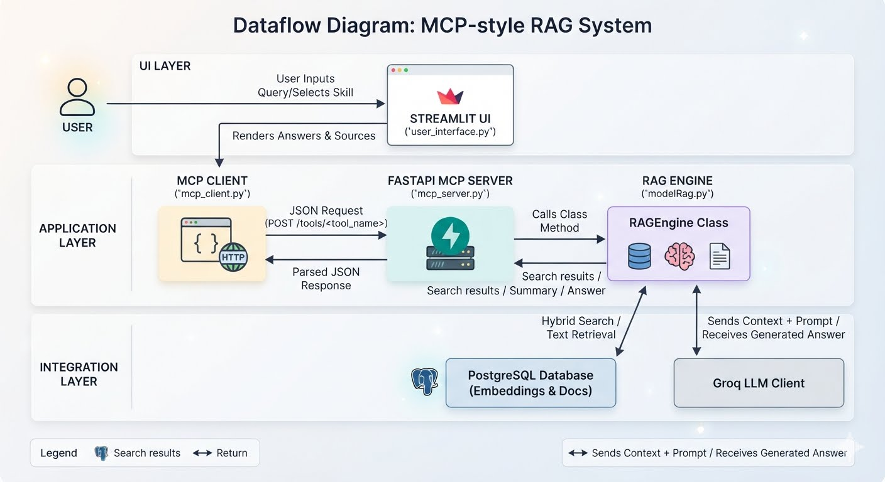

# Application Functionality

This application is an AI-powered Retrieval-Augmented Generation (RAG) system built with a small MCP-style server architecture.

## Components

### 1. `modelRag.py`
- Contains the `RAGEngine` class.
- Handles document retrieval, search, summarization, and answer generation.
- Uses:
  - PostgreSQL database with embeddings stored in `documents` table.
  - `sentence-transformers` to embed queries.
  - `groq` LLM client to generate natural language responses.
- Main methods:
  - `hybrid_search(query, top_k=5)` — finds relevant document chunks for a query.
  - `generate_response(query, context)` — builds a prompt from retrieved context and calls the LLM.
  - `summarize_document(filename)` — fetches document text from database or disk and summarizes it.
  - `list_documents()` — returns available document titles.

### 2. `mcp_server.py`
- Implements a FastAPI HTTP server exposing RAG skills as tool endpoints.
- Each endpoint maps to one `RAGEngine` method.
- Exposed tools:
  - `POST /tools/search_documents`
  - `POST /tools/answer_question`
  - `POST /tools/summarize_document`
  - `POST /tools/list_documents`
- The server is the middle layer between the UI and the RAG engine.

### 3. `mcp_client.py`
- Provides `MCPClient` to call the MCP server tools over HTTP.
- Sends JSON requests to `/tools/<tool_name>`.
- Handles connection errors, HTTP errors, and JSON response parsing.

### 4. `user_interface.py`
- Builds the Streamlit UI.
- Lets the user choose one of the available skills:
  - `answer_question`
  - `search_documents`
  - `summarize_document`
  - `list_documents`
- Sends user requests to the MCP server using `MCPClient`.
- Displays the response and any retrieved sources.

## System Dataflow

### Architectural Diagram
Below is the architectural layout showing how data flows through the different layers of the system.

### Dataflow Breakdown
1. **User Interaction:** The user interacts with the Streamlit frontend (`user_interface.py`) to select a skill and input their query.
2. **Client to Server Transport:** The UI passes the request to `mcp_client.py`, which formats and sends an HTTP POST request to the FastAPI server (`mcp_server.py`) via the `/tools/<tool_name>` endpoints.
3. **Engine Routing:** The FastAPI server receives the JSON request and calls the matching class method inside the `RAGEngine` (`modelRag.py`).
4. **Data Retrieval & Generation:** 
   - The engine embeds the incoming query using `sentence-transformers`.
   - It performs a hybrid search or text lookup against the **PostgreSQL Database** to retrieve relevant document chunks and source materials.
   - It combines the retrieved context with the user's original query into a structured prompt, sending it to the **Groq LLM Client** to generate a natural language response.
5. **Return Path:** The engine returns the answer or search results back to the FastAPI server, which passes a parsed JSON response back down to the client. The Streamlit UI ultimately renders the final response text and data sources for the user.

## How it works

1. Start the MCP server:
   - `python mcp_server.py`

2. Start the Streamlit UI:
   - `streamlit run user_interface.py`

3. The UI sends the selected skill request to the MCP server.

4. The MCP server calls the corresponding `RAGEngine` method.

5. For questions, the RAG engine:
   - embeds the query,
   - retrieves the top relevant document chunks,
   - sends prompt plus context to the LLM,
   - returns the generated answer and sources.

6. For search and summarization, the server returns search results or summaries directly.

## Why this architecture?

- Separates the UI from the AI logic.
- Makes the RAG engine reusable.
- Allows the UI to treat the server as a set of callable tools.
- Fits the MCP-style pattern of exposing skills via a tool API.

## Notes

- The MCP server is not a separate AI agent; it is a tool host.
- The actual RAG logic lives in `modelRag.py`.
- The UI is a client that calls the server and renders results.